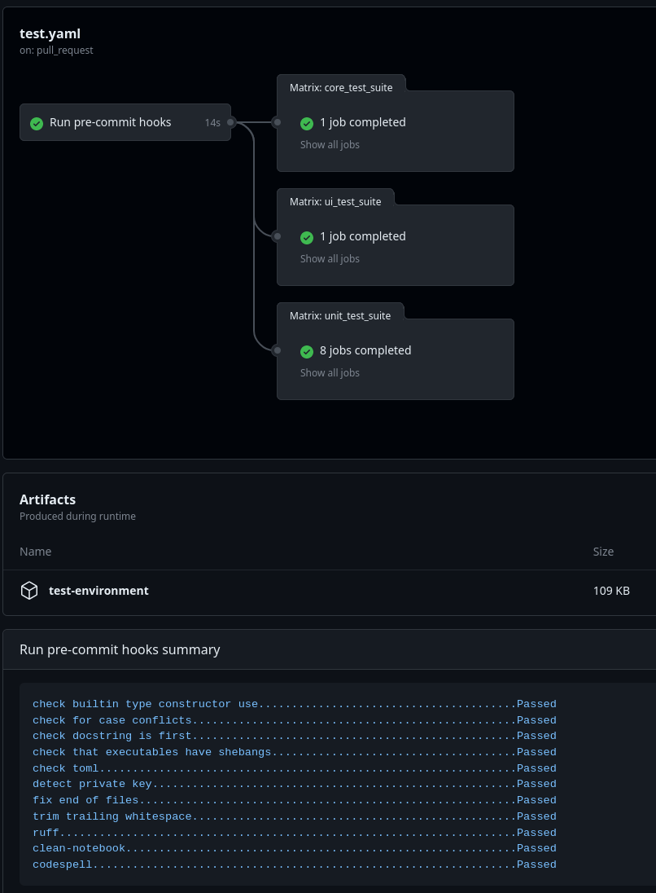

# Pre-commit Action for HoloViz CI

This action runs the pre-commit actions and will output the results to the summary page.

## Example

Here is an example using the pre-commit action to set up and cache a complicated environment:

```yaml
jobs:
  pre_commit:
    name: Run pre-commit
    runs-on: "ubuntu-latest"
    steps:
      - uses: holoviz-dev/holoviz_tasks/pre-commit@main
```

## Summary page

The summary page will show the results of the pre-commit actions.


